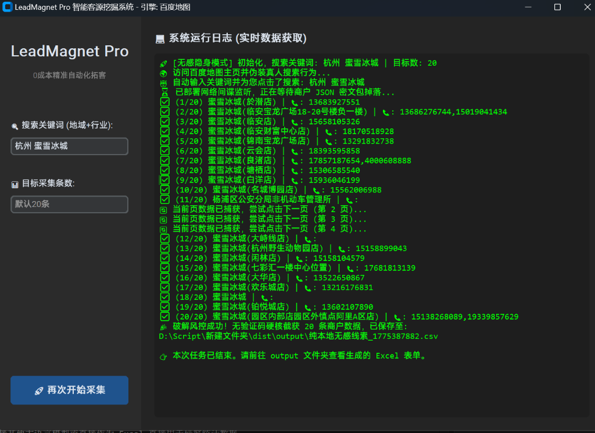

# 🕸️ MapSpider - 百度地图开源客源抓取器




**MapSpider** 是一款完全开源的、基于网络底层抓包技术的地图商户信息采集工具。它抛弃了易被风控的网页自动化解析路线，转而使用 `DrissionPage` 自动接管本机浏览器，从而实现了真正的“无感隐身”抓包。

它可以帮助开发者或研究人员快速且无门槛地按关键词获取目标区域商户的公开联系方式和地址。

## ✨ 核心特性

- **降维风控对抗**：借用本机浏览器及 Cookie 运行，彻底抹除机器指纹，直接免疫百度地图滑块验证码。
- **JSON 底层拦截**：不再使用易碎的页面节点 (Class/ID) 爬取。直接下潜至网络层监听返回的数据包，实现 100% 无死角提取商家信息及隐藏在前端的电话。
- **极其友好的 GUI**：开箱即用，带有极其现代感的暗黑模式控制台操作面板界面，告别枯燥命令行。

## 📦 部署与运行

由于本项目已经全面升级脱离 Playwright，现在安装非常简单，只要您的电脑上有 **Google Chrome** 或 **Microsoft Edge** 浏览器即可运行。

1. **安装环境依赖：**
   打开您的终端进入本项目文件夹，运行：
   ```bash
   pip install -r requirements.txt
   ```

2. **🛠️ 运行软件（必看前提条件！）：**
   由于全新的免杀机制需要强制通过 9222 调试端口接管您的物理浏览器。
   > **⚠️ 运行前警告**：请务必**完全关闭**您当前电脑上处于打开状态的所有 Google Chrome 和 Microsoft Edge 浏览器窗口，否则终端可能会卡住或报错。

3. **启动系统**
   执行以下命令唤起图形界面：
   ```bash
   python gui_app.py
   ```
   左侧设定好关键词及采集数，点击开始即可！

## 📁 数据存放

每次采集完毕，系统在当前目录下自动生成的 `output` 文件夹里导出 `.csv` 文件，内容包含：
* `商户名称` / `联系电话` / `详细地址`

可以方便地对接其他大语言模型或直接作为 Excel 直接用于研究统计数据。

---

## ⚠️ 法律与免责声明 (Disclaimer)

**本项目及相关代码免费开源使用，严禁买卖！**
本项目仅限于个人学习、学术交流或代码研究目的。**不得用于任何商业用途或者非法用途。** 
否则，因滥用本项目引发的乃至造成的一切法律纠纷及后果，均由使用者本人自行承担。任何人不得对项目进行二次封装并谋取商业私利。

> **强制要求：** 您必须在下载或获取本项目代码/软件后的 **24小时之内**，从您的电脑及所有存储设备中彻底删除上述内容。如果您不同意此条款，请立即停止使用并删除！
